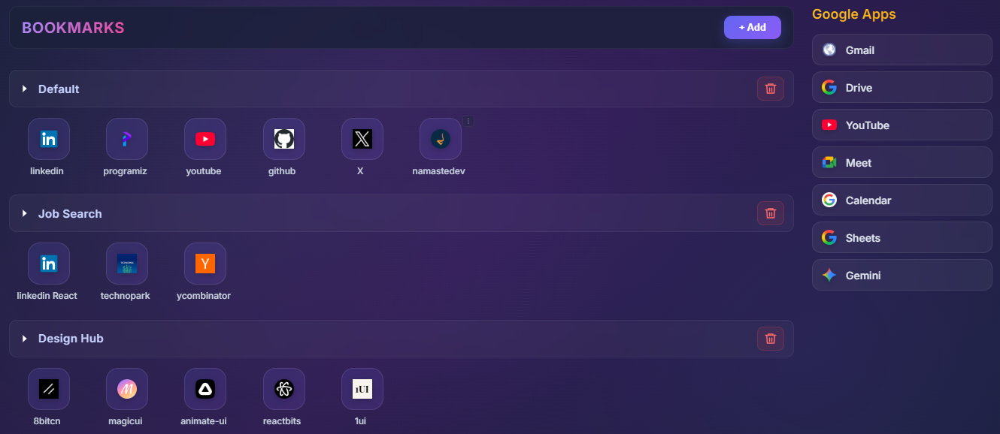

#  BookmarkFolder — A Customizable New Tab Bookmark Dashboard (Chrome Extension)

BookmarkFolder is a fully customizable **New Tab replacement** for Chrome.  
It lets you organize bookmarks into folders, drag & drop, rename, reorder, and manage them visually — all stored using Chrome Sync.

This project was built to replace cluttered bookmark bars with a clean and fast dashboard.

---

## 📸 Screenshot / Video

## ✨ Features

### 📁 Folder System  
- Create unlimited folders  
- Rename folders  
- Delete folders (with confirmation)  
- Bookmarks automatically move with folders  
- Drag a bookmark into another folder by dragging onto the folder header  

### 🔖 Bookmark Management  
- Add bookmark (Name + URL + optional folder)  
- Edit bookmark  
- Delete bookmark  
- Drag & drop reordering within a folder  
- Drag into another folder  
- Auto-fetch favicon  
- Default icon fallback if favicon fails  

### 🔽 Smart Folder Behavior  
- BookmarkFolder remembers which folders are open/collapsed  
- Only “Default” folder is expanded when extension is used for the first time  
- Refreshing the tab does **not** reset the open state  

### 🖼 Clean UI  
- Hover effects  
- Smooth collapse/expand animations  
- Right-side Google Apps quick launcher  

### 🌐 Google Apps Sidebar  
Quick shortcuts to:  
Gmail, Drive, YouTube, Meet, Calendar, Sheets, Gemini  
(each with auto-loaded favicons)

---

## 🏗 Tech Stack

- **Vanilla JavaScript (no frameworks)**  
- **Chrome Extensions API (Manifest V3)**  
- **Chrome Storage Sync**  
- **HTML + CSS**  

---

## 🛠 Installation (Developer Mode)

1. Open **chrome://extensions**
2. Enable **Developer mode** (top right)
3. Click **Load Unpacked**
4. Select your project folder
5. Open a new tab → BookmarkFolder loads instantly

---
## ⭐ If you like BookmarkFolder

Give the repo a **star** 🌟 on GitHub — it helps a lot!
